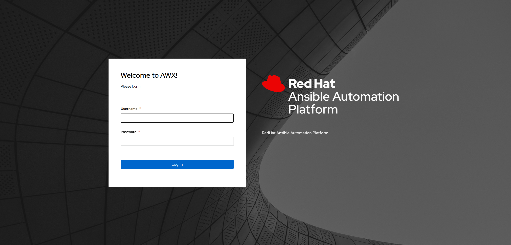

<!-- omit in toc -->
# 📚 Ansible AWX on Kubernetes

An example implementation of Ansible AWX on Kubernetes using AWX Operator, with easy-to-use simplified configuration with ownership of data and passwords.

- Accessible over HTTPS from remote host
- All data will be stored under `/data`
- Fixed (configurable) passwords for AWX and PostgreSQL
- Fixed (configurable) versions of AWX



<!-- omit in toc -->
## 📝 Environment

- Tested on:
  - AWX Operator 2.19.1
  - AWX 24.6.1
  - PostgreSQL 15

## 📝 References

- [INSTALL.md on ansible/awx](https://github.com/ansible/awx/blob/24.6.1/INSTALL.md) @24.6.1
- [README.md on ansible/awx-operator](https://github.com/ansible/awx-operator/blob/2.19.1/README.md) @2.19.1

## 📝 Requirements

- **Computing resources**
  - **2 CPUs minimum**.
    - Both **AMD64** (x86_64) with x86-64-v2 support, and **ARM64**  (aarch64) are supported.
  - **4 GiB RAM minimum**.
  - It's recommended to add more CPUs and RAM (like 4 CPUs and 8 GiB RAM or more) to avoid performance issue and job scheduling issue.
  - The files in this repository are configured to ignore resource requirements which specified by AWX Operator by default.
- **Storage resources**
  - At least **10 GiB for `/data`** are safe for fresh install.

## 📝 Deployment Instruction

### ✅ Install K8s

Install your own Kubernetes cluster
+ Prepare default storageclass (for ex: [rancher/local-path-provisioner](https://github.com/rancher/local-path-provisioner))
+ Prepare default ingressclass (for ex: [kubernetes/ingress-nginx](https://github.com/kubernetes/ingress-nginx))

### ✅ Install AWX Operator

Clone this repository and change directory.

```bash
git clone https://github.com/lucthienphong1120/ansible-automation-platform
cd awx-on-k3s
```

Then invoke `kubectl apply -k operator` to deploy AWX Operator.

<!-- shell: operator: deploy -->
```bash
kubectl apply -k operator
```

The AWX Operator will be deployed to the namespace `awx`.

<!-- shell: operator: get resources -->
```bash
$ kubectl -n awx get pod
NAME                                                   READY   STATUS    RESTARTS   AGE
pod/awx-operator-controller-manager-68d787cfbd-kjfg7   2/2     Running   0          16s
```

### ✅ Prepare required files to deploy AWX

<!-- shell: instance: generate certificates -->
```bash
AWX_HOST="awx.example.com"
openssl req -x509 -nodes -days 3650 -newkey rsa:2048 -out ./base/cert.pem -keyout ./base/private.key -subj "/CN=${AWX_HOST}/O=${AWX_HOST}" -addext "subjectAltName = DNS:${AWX_HOST}"
```

Modify `hostname` in `base/awx.yaml` if you want to use Ingress.

```yaml
...
spec:
  ...
  ingress_type: ingress
  ingress_hosts:
    - hostname: awx.example.com   👈👈👈
      tls_secret: awx-secret-tls
...
```

Uncomment there sections if you want to use Loadbalancer or Nodeport instead of Ingress (Comment out Ingress section too!)

```yaml
...
spec:
  ...
  service_type: NodePort
  nodeport_port: 30080

  # service_type: LoadBalancer
  # loadbalancer_ip: '192.168.10.25'
  # loadbalancer_protocol: https
  # loadbalancer_port: 443
  # loadbalancer_class: service.k8s.aws/nlb

  #ingress_type: ingress
  #ingress_class_name: nginx
  #ingress_hosts:
  #  - hostname: awx.example.com
  #    tls_secret: awx-secret-tls
...
```

Modify the two `password` entries in `base/kustomization.yaml`. Note that the `password` under `awx-postgres-configuration` should not contain single or double quotes (`'`, `"`) or backslashes (`\`) to avoid any issues during deployment, backup or restoration.

```yaml
...
  - name: awx-postgres-configuration
    type: Opaque
    literals:
      - host=awx-postgres-15
      - port=5432
      - database=awx
      - username=awx
      - password=Ansible123!   👈👈👈
      - type=managed

  - name: awx-admin-password
    type: Opaque
    literals:
      - password=Ansible123!   👈👈👈
...
```

Prepare directories for Persistent Volumes defined in `base/pv.yaml`. These directories will be used to store your databases and project files. Note that the size of the PVs and PVCs are specified in some of the files in this repository, but since their backends are `hostPath`, its value is just like a label and there is no actual capacity limitation.

<!-- shell: instance: create directories -->
```bash
sudo mkdir -p /data/postgres-15
sudo mkdir -p /data/projects
sudo chown 1000:0 /data/projects
```

### ✅ Deploy AWX

Deploy AWX, this takes few minutes to complete.

<!-- shell: instance: deploy -->
```bash
kubectl apply -k base
```

To monitor the progress of the deployment, check the logs of `deployments/awx-operator-controller-manager`:

<!-- shell: instance: gather logs -->
```bash
kubectl -n awx logs -f deployments/awx-operator-controller-manager
```

The deployment takes about 15 minutes. After it completes successfully, the logs end with:

```bash
$ kubectl -n awx logs -f deployments/awx-operator-controller-manager
...
----- Ansible Task Status Event StdOut (awx.ansible.com/v1beta1, Kind=AWX, awx/awx) -----
PLAY RECAP *********************************************************************
localhost                  : ok=90   changed=0    unreachable=0    failed=0    skipped=83   rescued=0    ignored=1
```

The required objects should now have been deployed next to AWX Operator in the `awx` namespace.

<!-- shell: instance: get resources -->
```bash
$ kubectl -n awx get pod,svc,ingress

NAME                                                  READY   STATUS      RESTARTS   AGE
pod/awx-operator-controller-manager-59b86c6fb-4zz9r   2/2     Running     0          7m22s
pod/awx-postgres-15-0                                 1/1     Running     0          6m33s
pod/awx-web-549f7fdbc5-htpl9                          3/3     Running     0          6m5s
pod/awx-migration-24.6.1-kglht                        0/1     Completed   0          4m36s
pod/awx-task-7d4fcdd449-mqkp2                         4/4     Running     0          6m4s

NAME                                                      TYPE        CLUSTER-IP      EXTERNAL-IP   PORT(S)    AGE
service/awx-operator-controller-manager-metrics-service   ClusterIP   10.43.58.194    <none>        8443/TCP   7m33s
service/awx-postgres-15                                   ClusterIP   None            <none>        5432/TCP   6m33s
service/awx-service                                       ClusterIP   10.43.180.226   <none>        80/TCP     6m7s

NAME                                    CLASS     HOSTS             ADDRESS         PORTS     AGE
ingress.networking.k8s.io/awx-ingress   traefik   awx.example.com   192.168.0.221   80, 443   6m6s
```

Now your AWX is available at `https://awx.example.com/` or the hostname you specified.

Note that you have to access via the hostname that you specified in `base/awx.yaml`, instead of by IP address, since this guide uses Ingress. So you should configure your DNS or `hosts` file on your client where the browser is running.

## 📝 Back up and Restore AWX using AWX Operator

The AWX Operator `0.10.0` or later has the ability to back up and restore AWX in easy way.

Refer for details:

- [📁 **Back up AWX using AWX Operator**](backup)
  - The guide to make backup of your AWX using AWX Operator.
  - This guide includes not only the way to make backup manually, but also an example simple playbook for Ansible, which can be use with scheduling feature on AWX.
- [📁 **Restore AWX using AWX Operator**](restore)
  - The guide to restore your AWX using AWX Operator.
